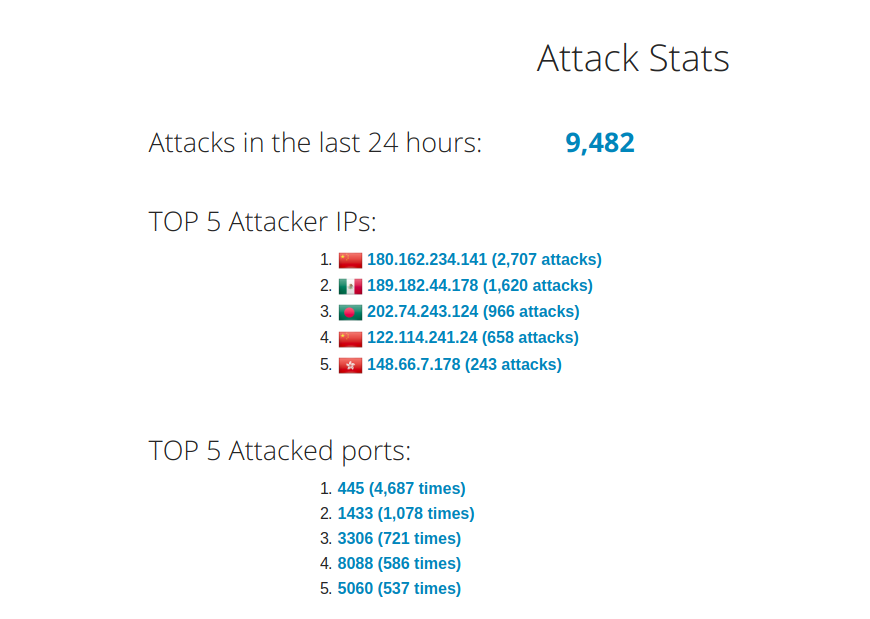
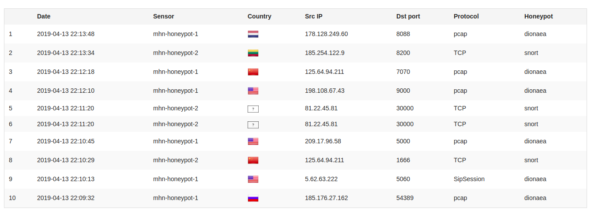
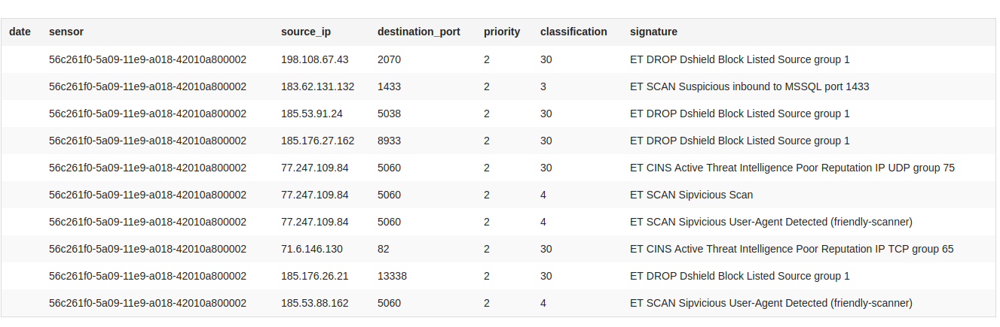

# honeypot
This is the research assignment for weeks 10 &amp; 11 in Codepath Cybersecurity course.

- Which Honeypot(s) you deployed.

  * Dionaea "mhn-honeypot-1"

  *  Snort "mhn-honeypot-2"

  *  Conpot "mhn-honeypot-3"
  
- Any issues you encountered.

  _Making sure to initally check http and https during setup of the MHN-admin was essential to being able to downlod the honeypots and deploy them._
  
- A summary of the data collected: number of attacks, number of malware samples, etc.

  * Data Collected: 
  
  * Attacks Reported: 
  
  * Payloads: 
  
  * JSON Export: 
  
- Any unresolved questions raised by the data collected.

  _None._
